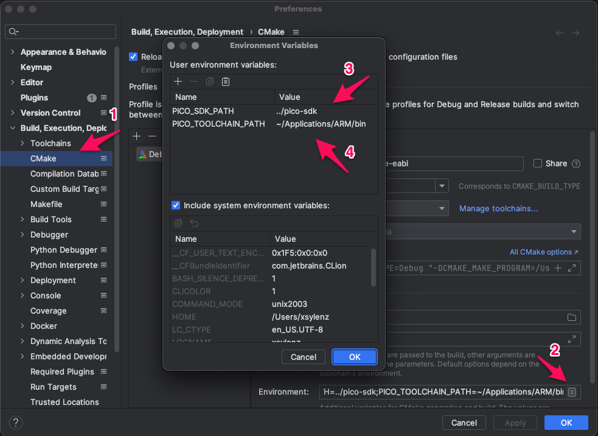

# rp2040-freertos-project

## Clion:
For the SDK to understand where the toolchain path is, it is necessary to add 'PICO_TOOLCHAIN_PATH' in the environment variables. To do so in CLion, open the settings menu and  go to:
1. Build, Execution,  Deployment -> CMake;
2. Environment;
3. Environment var.: Pico SDK Path (relative to build folder)
4. Environment var.:  Pico Toolchain -> ARM binary path

